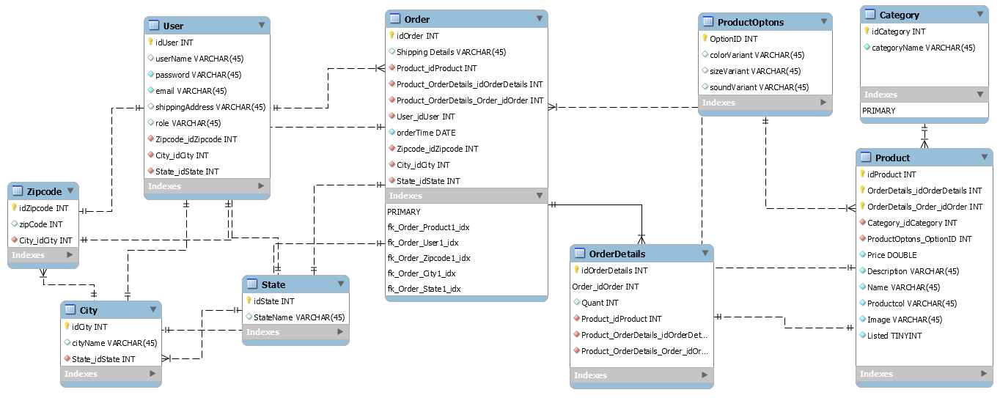

# About
Cosminis are a recent hit involving digital companions that users interact with and care for in a social media setting. With the rise in popularity of this sensation; our store provides fans a way to bring the online experience into their homes in the form of cute plushies themed to each character. On our website each user can register and browse a unique collection of cosmini stuffed animals and place orders to be delivered straight to their home. Our application plans to feature an exciting "construct-your-own" tool, where
users can craft their own special cosmini; and add personal flair to each item shipped! 

# User Stories
As a user, I should be able to Login and Register
As a user, I should be able to sort by type of product (Search for produts)
As a user, I should be able to view all products on a store front
As a user, I should be able to add products to a cart that will keep track of my potential purchases
As a user, I should be able to checkout items from cart through a purchasing interface
As a user, I should be able to view old carts

# Goals
- Login and Register
    - Authservices to verify that the user is a valid user of the system
- Sort by type of product (Search for produts)
    - Search through categories of products to choose selection options 
- View all products on a store front
    - Neat store front that contains a navigation bar and list of available products
- Add products to a cart
    - Option to select products to potentially purchase
- Checkout items from cart
    - Option to purchase carts 
- User profiles
    - View old carts
- Reset Password
    - Authservices to change user information
- Documentation
    - General documentation on the code itself along with documentation on the meetings and project protocols
- CI/CD Pipeline
    - DevOps pipeline to speed up development and verify safe code to merge to main
- Publication
    - DevOps pipeline to speed up deployment of the Angular app and verify safe code to merge
- 70% Code coverage
    - Test Driven Development to verify that the verticals and methods work as intended

# Stretch Goals
- Select a greater amount of items at once
- Product reviews
- User can sell and buy (marketplace)
- Dark Mode
- Custom Builder
- Auth0 

# Technologies used
- Backend
    - C#
    - ASP.NET
    - ADO.NET
    - .NET core
    - Entity Framework Core
- Front end
    - Angular 10
    - Node.js
    - Swagger
    - HTML/JS/TS/CSS
    - Core Web API
    - Bootstrap
- Testing
    - xUnit
    - Moq 
- DevOps
    - Git
    - Github Actions
    - Sonarcloud
- Database
    - SQL Server
    - Azure SQL Databases
    - Azure Cloud

# ERD

# Trello
[Here is the trello](https://trello.com/b/O0zGF9j4/juniper-commerce-capstone-1406)

# Github
[Here is the Repository](https://github.com/220620NET/Craft-A-Cosmo)